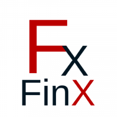

[![Contributors][contributors-shield]][contributors-url]
[![Forks][forks-shield]][forks-url]
[![Stargazers][stars-shield]][stars-url]
[![Issues][issues-shield]][issues-url]

 

  

<h3 align="center">FinX</h3>

  

    A Financial Literacy solution
     
    <a href="https://github.com/PalD777/intuition-8.0"><strong>Explore the docs »</strong></a>
     
     
    <a href="https://github.com/PalD777/intuition-8.0/issues">Report Bug</a>
    ·
    <a href="https://github.com/PalD777/intuition-8.0/issues">Request Feature</a>
  

  
Table of Contents

  <ol>
    <li><a href="#installation">Installation</a></li>
    <li><a href="#inspiration">Inspiration</a></li>
    <li><a href="#what-it-does">What It does</a></li>
    <li><a href="#idealogy-behind-the-project">Ideology behind the project</a></li>
    <li><a href="#how-we-built-it">How we Built It</a></li>
    <li><a href="#challenges-we-ran-into">Challenges we ran into</a></li>
    <li><a href="#what-we-learned">What we learned</a></li>
    <li><a href="#whats-next-for-finx">What's next for FinX</a></li>
  </ol>

## Installation
To install the required modules, use pip install -r "requirements.txt"

(<a href="#top">back to top</a>)

## Inspiration
Despite the significant increase in the quality of education over the last few years, there has been a concerning question on financial literacy. A study conducted suggests that despite the literacy rates worldwide being over 86%, only around 33% of adults understand basic financial concepts such as taxes, inflation, and credit. Furthermore, only 24% of millennials understand these basic financial topics. This is an enormous cause for concern. Introducing FinX, an immersive platform for learning financial concepts. Our model is based on making learning about finance as engaging as a game.

(<a href="#top">back to top</a>)

## What It does
FinX provides each person with a personalized gamified experience to accelerate their financial literacy journey. We use an in-game blockchain-based currency called FEX with an exchange rate to real currency for purchase tracking. Our main learning platform is FinGame – a gamified way of teaching lessons on finance. People can participate in immersive courses on financial concepts such as stocks, inflation or NFT s. Each learning lesson comes with an interactive experience of being able to experience the lesson for themselves. For instance, the inflation lesson provides a button to make the exchange rate between FEX and Dollars increase, thereby demonstrating the ill effects of inflation. Using their acquired in-game currency, we provide users with the opportunity to either buy stocks or cryptocurrency based on real prices, or NFTs. They can hence use the platform of FinX as a sandbox for real stock and crypto market systems or NFT systems. Users who purchase NFTs will be able to see their NFTs in the gallery on the profile page. Users are also given an opportunity to make a profit off their stock and cryptocurrency investments based on real-time trends. We also have incorporated a leaderboard to make it more competitive and increase the gamification aspect. Hence, by providing users with a gamified, simple-to-use, and rewarding platform to increase their financial literacy, our app prepares them for the economics of the real world.

(<a href="#top">back to top</a>)

## Ideology behind the project
We wished to use our project as a platform to promote a healthy and engaging learning experience. We have used techniques such as leaderboard positions, a point system, as well as interactive lessons with the inflation/deflation parameter buttons to achieve the same. We also wished for the user experience to be friendly and welcoming. We achieved this by custom-making CSS color schemes for the webpages, and base templates, as well as visually attractive buttons. Our modular course and NFT systems also make it very easy to further add objects to the website and make the updation process very simple as well.

(<a href="#top">back to top</a>)

## How we Built It
FinX is a progressive web app that uses a firebase database to authenticate the user via their google accounts. We use this account connected to a database to store every user’s course information, coins, NFTs, inflation, and deflation. To keep track of inflation and deflation, we change the conversion rate between currencies for the user and store it. For courses, we search for text files in a specific folder and render them. This allows us to easily add new courses by just adding a file to the folder. The code handles serving the course and tracking progress, allowing an intuitive and simple experience. The NFTs are given a price between $10 and $70 and allow a user to purchase it with their points based on the conversion rate.

The stock market and crypto simulators are based on real-world data but use in-game currency instead of fiat to provide a safe paper trading experience.

(<a href="#top">back to top</a>)

## Challenges we ran into
Creating a platform for users to invest their in-game currency on stocks and cryptocurrency
Creating the NFTs and the processing of the page from scratch
Syncing up the flask app with the firebase database
Creating the blockchain system from scratch
Making a dynamically updating system for the inflation and deflation features to change the interactions within other spheres such as costs of NFTs, etc.

(<a href="#top">back to top</a>)

## Accomplishments that we are proud of
Being able to complete everything we hoped to achieve at the start of the hackathon
Being able to make a progressive web app
Creating a complete crypto-system with flask as the front-end and firebase as the back-end, which has never been done before
Creating a leaderboard section after deciding we wished to incorporate it in future versions
Making a full-scale NFT trading and inventory system from scratch
Making a dynamic system for prices to evolve within the simulations
Distributing work evenly and fairly among the team and allocating work to each of our strengths
Being able to deploy the code such that it is usable by all.

(<a href="#top">back to top</a>)

## What we learned
We learned in detail how to use flask to host web-servers
We learned how to use firebase in Python smoothly and save NFTs in firebase.
We learned more about finance and its importance
We learned how to incorporate financial tools such as stocks and cryptocurrency
We learned how to facilitate the sharing of information between the front-end (HTML, CSS, JS) with the back-end (Python, FireBase)
We learned the importance of understanding our strengths and allocating work accordingly
We understood the need to help each other out under all circumstances and remain together as a team
We learned to be adaptable and change our approach when things didn't pan out.

(<a href="#top">back to top</a>)

## What's next for FinX
We wish to add more courses and even video games on the topic of finance to make it even more engaging
We would like to try and scale the project up and make this a global medium of financial exchange. We have already taken our first step by using a firebase database and including a leaderboard section, but we would also like to create a platform where each user can upload their own NFTs or even a blog post for sharing one’s views.

(<a href="#top">back to top</a>)

[contributors-shield]: https://img.shields.io/github/contributors/PalD777/intuition-8.0.svg?style=for-the-badge
[contributors-url]: https://github.com/PalD777/intuition-8.0/graphs/contributors
[forks-shield]: https://img.shields.io/github/forks/PalD777/intuition-8.0.svg?style=for-the-badge
[forks-url]: https://github.com/PalD777/intuition-8.0/network/members
[stars-shield]: https://img.shields.io/github/stars/PalD777/intuition-8.0.svg?style=for-the-badge
[stars-url]: https://github.com/PalD777/intuition-8.0/stargazers
[issues-shield]: https://img.shields.io/github/issues/PalD777/intuition-8.0.svg?style=for-the-badge
[issues-url]: https://github.com/PalD777/intuition-8.0/issues